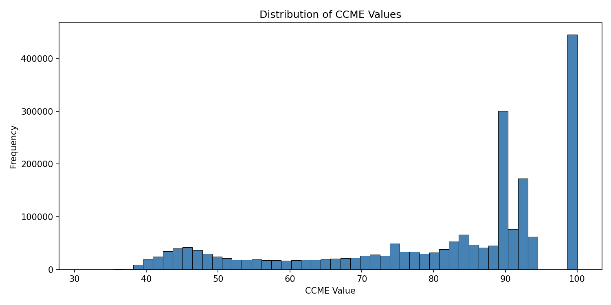
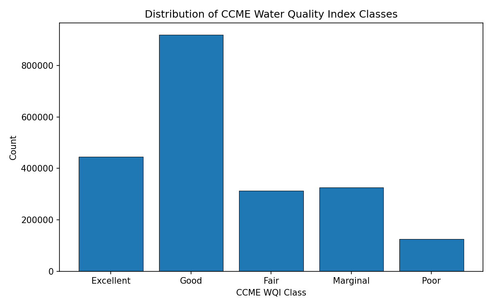
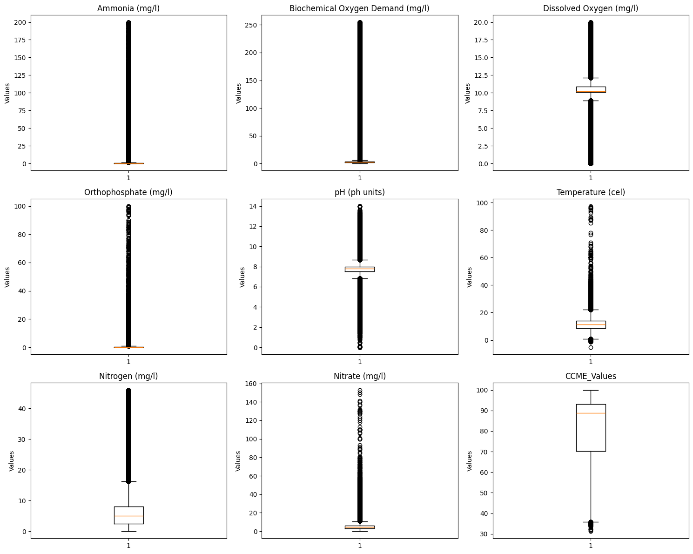
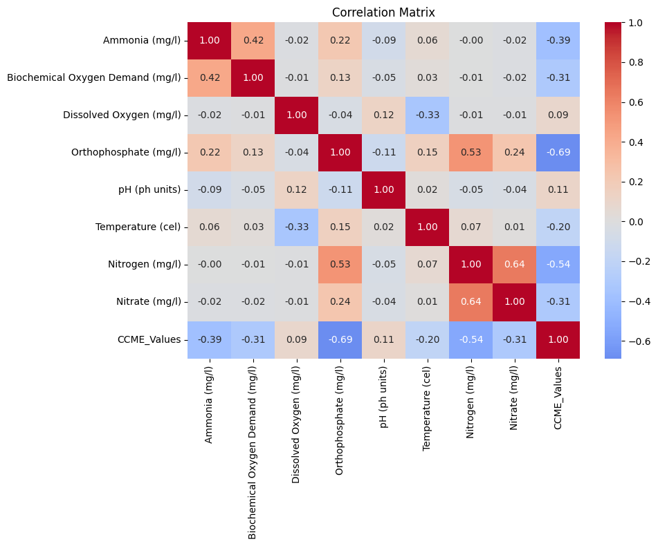
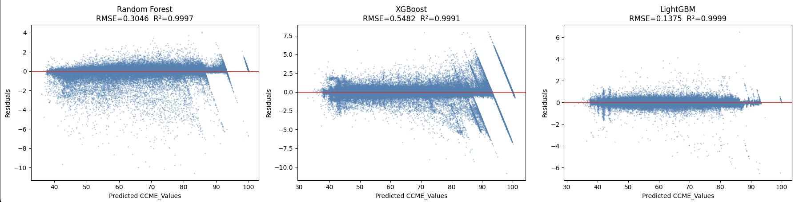
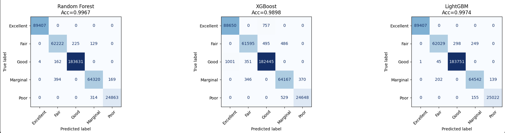
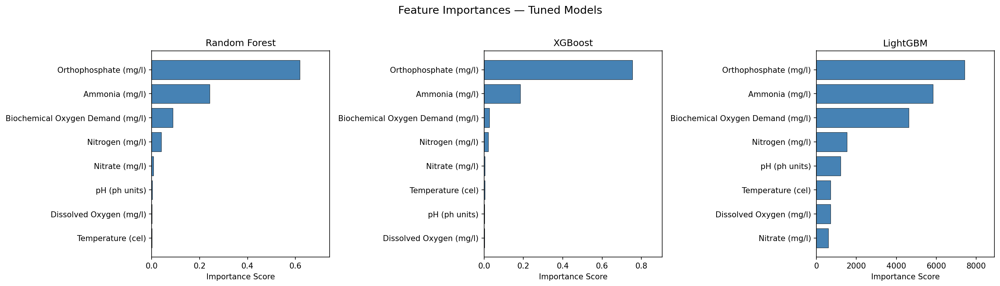

# Comparing ML Algorithms for Water Quality Prediction in England

A data science capstone project comparing tree-based machine learning algorithms for predicting water quality in England using a large-scale surface water quality dataset spanning 2000–2023.

---

## Table of Contents

- [Project Background](#project-background)
- [Dataset](#dataset)
- [EDA & Data Processing](#eda--data-processing)
- [Models](#models)
- [Results](#results)
- [Limitations & Caveats](#limitations--caveats)
- [References](#references)

---

## Project Background

Water quality in England has declined significantly due to agricultural runoff, sewage discharges, urban pollution, and habitat destruction. As of 2024, the Environment Agency reports that only **14% of rivers in England** meet "good ecological status" as defined by the Water Framework Directive — underscoring the urgency for scalable, data-driven monitoring tools.

This project compares multiple machine learning algorithms across two parallel prediction tasks:

| Task | Type | Target |
|------|------|--------|
| **WQI Prediction** | Regression | `CCME_Values` — a continuous score from 0 to 100 |
| **WQC Prediction** | Classification | `CCME_WQI` — a categorical label (Poor / Marginal / Fair / Good / Excellent) |

Both targets are derived from the Canadian Council of Ministers of the Environment (CCME) Water Quality Index framework:

| Class | WQI Range |
|-------|-----------|
| Excellent | 95–100 |
| Good | 80–94 |
| Fair | 65–79 |
| Marginal | 45–64 |
| Poor | 0–44 |

---

## Dataset

**Source:** Karim et al. (2025), *"A Comprehensive Dataset of Surface Water Quality Spanning 1940–2023 for Empirical and ML Adopted Research"*

- **Geography:** England (filtered from a global harmonised dataset)
- **Time period:** January 2000 – October 2023
- **Observations:** 2,129,198 rows

**8 input features (water quality parameters):**

| Feature | Unit |
|---------|------|
| Ammonia | mg/l |
| Biochemical Oxygen Demand (BOD) | mg/l |
| Dissolved Oxygen | mg/l |
| Orthophosphate | mg/l |
| pH | ph units |
| Temperature | °C |
| Nitrogen | mg/l |
| Nitrate | mg/l |

**Waterbody types in the dataset:**

| Type | Count |
|------|-------|
| River | 1,349,576 |
| Effluent | 601,550 |
| Estuarine | 49,375 |
| Lake | 33,771 |
| Sea Water | 32,061 |
| Canal | 28,574 |
| Sewage | 23,777 |
| Drainage | 10,205 |
| Marine | 309 |

**WQI and WQC distributions:**
There is a much larger number of observations in the WQI range of 80-94, which corresponds to the much larger proportion of observations with class “Good”. However, the proportion of these outstanding observations of the total number of observations is not large enough to conclude this as a class imbalance issue. Therefore, I did not remove any data.

  

  

---

## EDA & Data Processing

Exploratory analysis is in [`eda.ipynb`](notebooks/eda.ipynb).

### Key findings

**Parameter distributions:** Ammonia, BOD, and Orthophosphate are heavily right-skewed with compressed interquartile ranges, consistent with pollution data where most readings are low but extreme events push the tail far right.

  

**Outlier detection:** Tukey's IQR method (inner fence: 1.5×IQR; outer fence: 3×IQR) was applied to all features. Despite a small percentage of flagged values relative to total sample size, **outliers were retained** — extreme pollutant readings represent real pollution events and carry genuine ecological signal. Removing them would bias the models toward cleaner conditions and undermine their real-world applicability.

**Feature correlations with CCME_Values:**

  

Nitrogen and Nitrate are moderately co-linear (r = 0.64), and Orthophosphate–Nitrogen also show moderate correlation (r = 0.53).

### Data preprocessing

1. Dropped non-predictive columns: `Country`, `Area`, `Waterbody Type`, `Date`
2. Dropped the non-target outcome column to prevent leakage (e.g., `CCME_WQI` is dropped for the regression task; `CCME_Values` is dropped for the classification task)
3. Applied a **60/20/20 train/validation/test split** (stratified by random seed 42)
4. Applied **MinMaxScaler** fit on the training set only, then transformed validation and test sets — enables fair cross-model comparison including SVM

---

## Models

Four algorithm families were evaluated on both tasks. All models use scikit-learn's API.

### Random Forest

Builds an ensemble of decision trees using **bagging** — each tree is trained on a random bootstrap sample and considers a random feature subset at each split. Final prediction is the majority vote (classification) or average (regression). Baseline configuration: 100 trees, `max_features=1/3`, OOB scoring enabled.

### XGBoost

Uses **gradient boosting** in a level-wise (depth-first) strategy. Each successive tree corrects the residual errors of the previous ensemble. Includes built-in L1/L2 regularisation and gain-based pruning to control complexity.

### LightGBM

Also uses gradient boosting but with a **leaf-wise** growth strategy — at each step it splits the single leaf that yields the largest loss reduction, rather than expanding the entire level. This allows some branches to grow much deeper, capturing complex non-linear relationships efficiently. Notably faster and more memory-efficient than XGBoost on large datasets.

### Hyperparameter tuning

`RandomizedSearchCV` (3-fold CV, 20 iterations, scored on RMSE for regression / accuracy for classification) was applied to RF, XGBoost, and LightGBM on a subsample. The test set was evaluated **only once**, after all modelling decisions were finalised, to prevent information leakage.

---

## Results

### WQI Regression  

| Model | R² | RMSE | MAE |
|-------|----|------|-----|
| Random Forest | 0.9997 | 0.3046 | 0.0779 |
| XGBoost | 0.9991 | 0.5482 | 0.2046 |
| **LightGBM** | **0.9999** | **0.1375** | **0.0591** |
| SVR (baseline only) | 0.7247 | 9.5115 | 7.1065 |

**LightGBM achieves the best regression performance** across all three metrics.

Residual plots for RF and XGBoost show downward-sloping linear artefacts near predicted values of 90–100. These are structural artefacts of the CCME formula — at the ceiling of the index, small feature differences map to large residual swings. LightGBM produces the cleanest residuals.

  
   
  <em>Residual plots for WQI Regression Models</em>

### WQC Classification  

| Model | Accuracy |
|-------|----------|
| Random Forest | 0.9967 |
| XGBoost | 0.9898 |
| **LightGBM** | **0.9974** |

**LightGBM achieves the best classification accuracy.** Notably, the Random Forest baseline model slightly outperformed its tuned version — the default parameters were already well-suited to this dataset's structure.

  
   
  <em> Confusion matrix for WQC Classification models </em>

### Feature importance

For both the regression and classification tasks, Orthophosphate, Ammonia, and Biochemical Oxygen Demand are the top 3 features that contribute the most to the high prediction accuracy for all 3 models. 

  

This ranking is consistent with the Pearson correlations from EDA and aligns with the known chemistry of the CCME WQI formula.

---

## Limitations & Caveats

**1. Near-deterministic targets**
The CCME WQI formula is a mathematical function of the 8 input parameters — meaning `CCME_Values` and `CCME_WQI` are structurally determined by the features. The near-perfect metrics (R² ≈ 0.9999, accuracy ≈ 0.997) reflect the models learning this underlying formula rather than generalising ecological patterns. The models may not generalise to datasets computed under a different WQI framework.

**2. No temporal modelling**
The dataset spans 23 years, but date information was dropped and records were treated as i.i.d. observations. Temporal autocorrelation, seasonal cycles, and trends are not captured. Future work could explore time-series approaches (e.g., sliding-window features, LSTM) to learn temporal dynamics.

**3. Data source homogeneity**
The dataset originates from a single publicly available harmonised source. The variation in water conditions may not fully reflect the true range across all of England's waterbody types. Estuarine, marine, and effluent records behave differently from freshwater records and are included without waterbody-type stratification.

---

## References
- A. Helaly, M., Rady, S., Mabrouk, M., M. Aref, M., Villarroya, S., Cotos, J. M., & Mera, D. (2025). Advancements in water quality prediction: A practical review of machine learning and deep learning approaches. Cluster Computing, 28(9), 598. https://doi.org/10.1007/s10586-025-05221-3	
- Bolick, M. M., Post, C. J., Naser, M.-Z., & Mikhailova, E. A. (2023). Comparison of machine learning algorithms to predict dissolved oxygen in an urban stream. Environmental Science and Pollution Research, 30(32), 78075–78096. https://doi.org/10.1007/s11356-023-27481-5	
- Canadian Council of Ministers of the Environment. (2017). CCME water quality index user's manual: 2017 update (Publication No. 1299). https://www.ccme.ca/en/resources/canadian_environmental_quality_guidelines/calculators.html	
- Chen, Y., Song, L., Liu, Y., Yang, L., & Li, D. (2020). A Review of the Artificial Neural Network Models for Water Quality Prediction. Applied Sciences, 10(17), 5776. https://doi.org/10.3390/app10175776	
- Hridoy, Md. A. A. M., Shawkat, A. I., Bordin, C., Acharjee, M. R., Masood, A., Baki, A. O., & Al Mamun, Md. A. (2025). Advanced machine learning models for accurate water quality classification and WQI prediction: Implications for aquatic disease risk management. Science of The Total Environment, 1008, 180965. https://doi.org/10.1016/j.scitotenv.2025.180965	
- Karamoutsou, L., & Psilovikos, A. (2021). Deep Learning in Water Resources Management: Τhe Case Study of Kastoria Lake in Greece. Water, 13(23), 3364. https://doi.org/10.3390/w13233364	
- Karim, Md. Rajaul; Syeed, Mahbubul; Rahman, Ashifur; Rabbani, Khondkar Ayaz; Fatema, Kaniz; Khan, Razib Hayat; et al. (2025). A Comprehensive Surface Water Quality Monitoring Dataset (1940-2023): 2.82Million Record Resource for Empirical and ML-Based Research. figshare. Dataset. https://doi.org/10.6084/m9.figshare.27800394.v2	
- Shams, M. Y., Elshewey, A. M., El-kenawy, E.-S. M., Ibrahim, A., Talaat, F. M., & Tarek, Z. (2023). Water quality prediction using machine learning models based on grid search method. Multimedia Tools and Applications, 83(12), 35307–35334. https://doi.org/10.1007/s11042-023-16737-4	
- Tyagi, S., Sharma, B., Singh, P., & Dobhal, R. (2020). Water Quality Assessment in Terms of Water Quality Index. American Journal of Water Resources, 1(3), 34–38. https://doi.org/10.12691/ajwr-1-3-3	
- Wang, X., Li, Y., Qiao, Q., Tavares, A., & Liang, Y. (2023). Water Quality Prediction Based on Machine Learning and Comprehensive Weighting Methods. Entropy, 25(8), 1186. https://doi.org/10.3390/e25081186	